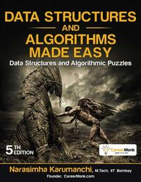
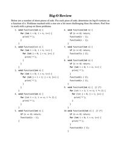
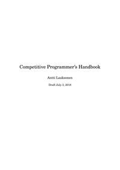
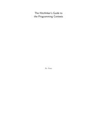

# List of Books
Generated on Thu Aug  8 11:26:50 UTC 2024

## Cracking-the-Coding-Interview-6th-Edition-189-Programming-Questions-and-Solutions

## Data Structures and Algorithms Made Easy_ Data Structures and Algorithmic Puzzles

## Dynamic-Programming-for-Interviews

## Guide-to-Competitive-Programming-Learning-and-improving-Algorithms-through-Contests

## Introduction-to-algorithms-third-edition

## Standard Algorithms and Data Structures

## book

## icpc

