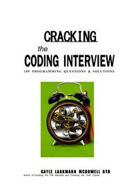
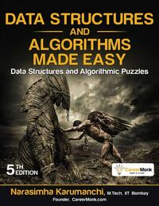
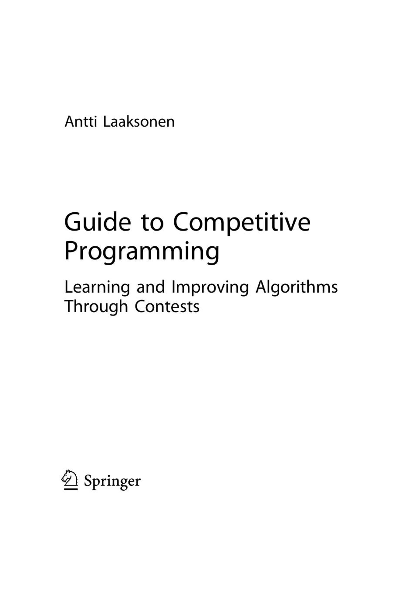
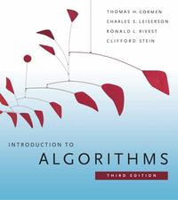
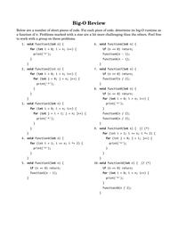
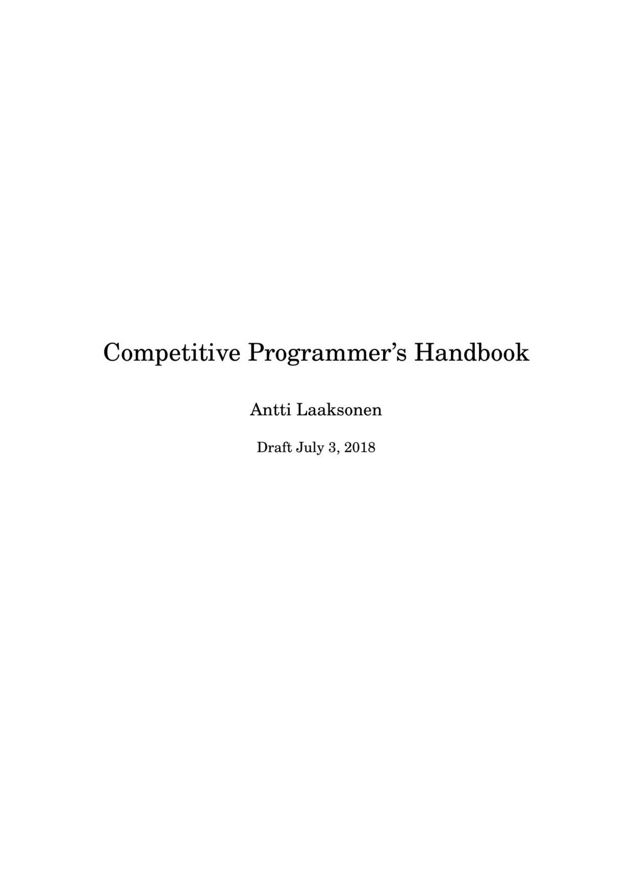
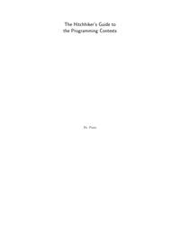

# List of Books
Generated on Thu Aug  8 12:25:03 UTC 2024

## Cracking-the-Coding-Interview-6th-Edition-189-Programming-Questions-and-Solutions

## Data_Structures_and_Algorithms_Made_Easy__Data_Structures_and_Algorithmic_Puzzles

## Dynamic-Programming-for-Interviews

## Guide-to-Competitive-Programming-Learning-and-improving-Algorithms-through-Contests

## Introduction-to-algorithms-third-edition

## Standard_Algorithms_and_Data_Structures

## competitive-programmers-handbook

## icpc_guide

